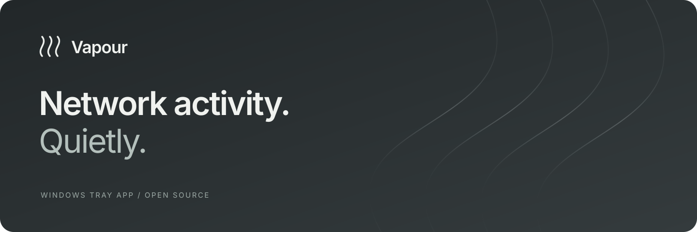
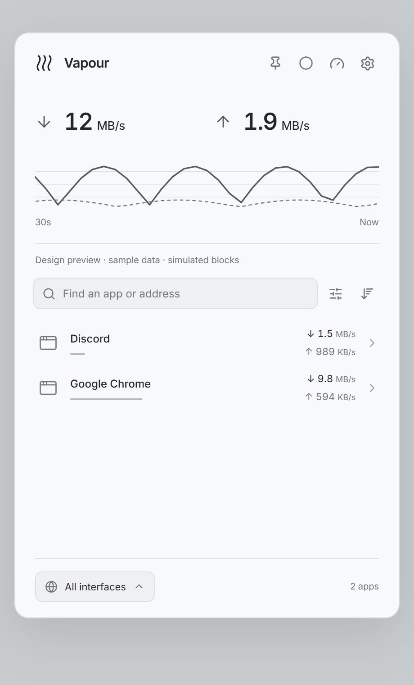
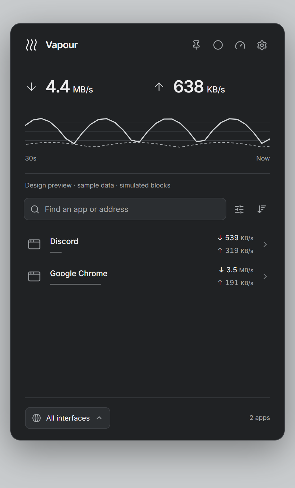
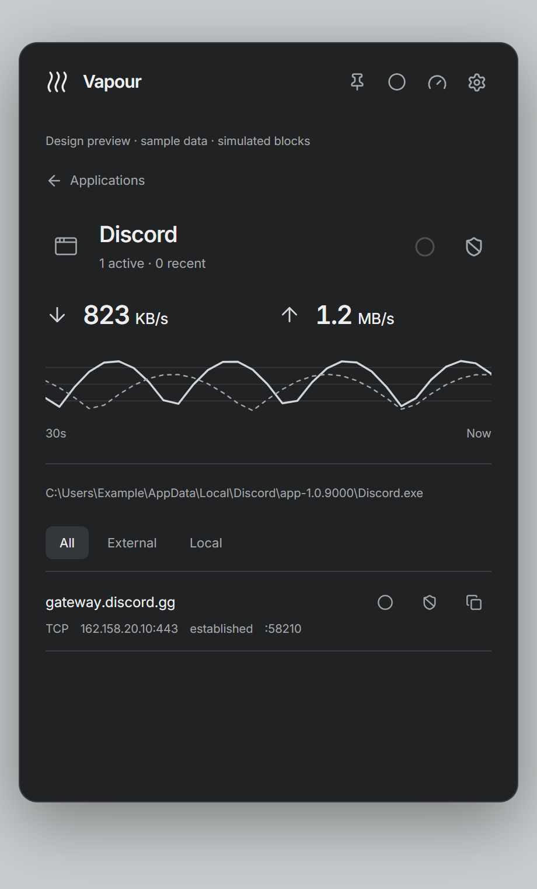

<p align="center">
  
</p>

<p align="center">
  <strong>A calm Windows tray app for understanding your network.</strong><br>
  See what is active, inspect connections, measure your internet speed and capture traffic.
</p>

<p align="center">
  <a href="#get-started">Get started</a> ·
  <a href="#screenshots">Screenshots</a> ·
  <a href="docs/ROADMAP.md">Roadmap</a> ·
  <a href="CONTRIBUTING.md">Contribute</a>
</p>

<p align="center"><strong>Windows x64 · Early alpha · GPL-3.0-only</strong></p>

## Quiet by design

Vapour stays in the tray until you need it. A restrained palette, compact controls and light and dark themes keep network information readable without making it the centre of your workflow.

- **See activity.** Interface throughput, per-app rates, recent history and searchable connections.
- **Inspect destinations.** Numeric endpoints and cached reverse-DNS hints; recently closed connections stay visible briefly.
- **Control outbound traffic.** Persistent Windows Firewall blocks for an executable or a concrete TCP connection.
- **Measure your connection.** A LibreSpeed-based engine with automatic server selection, custom servers and separate latency, jitter, download and upload windows of at least ten seconds each.
- **Capture locally.** Bounded interface, TCP-session and partial app captures, exported as PCAPNG for analysis in other tools.
- **Make it yours.** Light, dark or system appearance; optional monochrome app icons; native transparency with a solid fallback.

## Screenshots

All screenshots below use built-in **sample data**, not personal traffic. Browser previews illustrate the interface; native monitoring and firewall actions require Windows.

<table>
  <tr><th>Light</th><th>Dark</th><th>Connection details</th></tr>
  <tr>
    <td></td>
    <td></td>
    <td></td>
  </tr>
</table>

## Get started

This is an early, source-first alpha. There is no signed installer or stable binary release yet. Windows x64 is the current native target; Linux and macOS are planned.

### Requirements

- Windows 10/11 x64 with WebView2 and the Visual Studio C++ build tools / Windows SDK.
- Node.js 24 LTS and pnpm 11.27.0.
- Rust through rustup; `rust-toolchain.toml` selects the tested Windows MSVC toolchain.
- Go 1.27.1 (tested); the speedtest module requires at least Go 1.26.

### Build from source

From the repository root in PowerShell:

```powershell
pnpm install --frozen-lockfile
powershell -NoProfile -File scripts/setup-windivert.ps1
pnpm build:native
```

The WinDivert setup downloads a pinned official release, verifies its SHA-256 and stages the x64 runtime locally. Those binaries are excluded from Git. This step does not load or install the driver. Appcapture loads the driver on demand with administrator access.

The standalone executable is `src-tauri/target/release/vapour.exe`. Use `pnpm build:native`: it embeds the frontend and the matching native command set. If Go is not on `PATH`, set `$env:GO_BIN` to its executable before building.

For browser-only design work, `pnpm dev` runs the sample-data preview without administrator access. `pnpm exec tauri dev` runs the native development build; elevation is available only in standalone release builds.

## Know the boundaries

This alpha favours excluding uncertain data over presenting guesses as facts.

| Area | Current boundary |
| --- | --- |
| App measurements | Require administrator access. Very short-lived processes, event loss and sustained load need broader validation. |
| Appcapture | Marked **Partial**. Native tests cover new incoming/outgoing TCP/UDP and stable existing TCP connections over IPv4/IPv6. Processes must be present at capture start. Rapid reuse, process churn and sustained-load coverage remain unverified. Counts are finalized on stop. |
| Capture limits | Interface/session capture: 60 seconds / 64 MiB. Appcapture: 60 seconds with a 32 MiB collection budget and event limits. Driver queues are additional. Unknown app packets are excluded. |
| Firewall | Outbound rules only. Rules remain until explicitly removed. Vapour does not enable disabled firewall profiles automatically. |
| Destination names | Reverse DNS and other labels are hints, not verified service identity. |
| Speedtest | HTTP-based measurements depend on the selected server and route. Latency and jitter are not ICMP measurements. |
| Platforms | Native Windows implementation only. Cross-platform support is on the roadmap. |

Administrator mode currently elevates the whole app. A separate privileged helper, stronger performance/loss validation and release hardening are planned. This is not a security appliance or a complete packet-forensics solution.

## Privacy

Vapour has no application telemetry and does not upload capture files. Capture files and preferences are stored locally. Reverse-DNS lookups, speedtests and server-catalog requests generate network traffic as part of those features. Fonts are bundled locally.

Please redact executable paths, IP addresses and hostnames before sharing real screenshots or logs. Do not attach packet captures containing private traffic to public issues.

## Development and contribution

See [CONTRIBUTING.md](CONTRIBUTING.md) for checks and contribution guidance, and [the roadmap](docs/ROADMAP.md) for planned work. Small, focused improvements and reproducible Windows bug reports are welcome.

## License and acknowledgements

Vapour is licensed under [GPL-3.0-only](LICENSE). Third-party components retain their own licenses; see [third-party notices](THIRD_PARTY.md).

Built with Tauri, Rust, React and Lucide, with Inter typography, a modified LibreSpeed CLI engine and WinDivert for appcapture.
